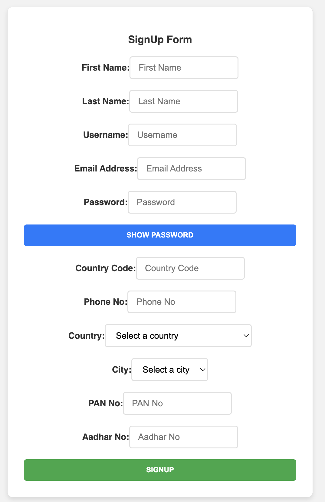
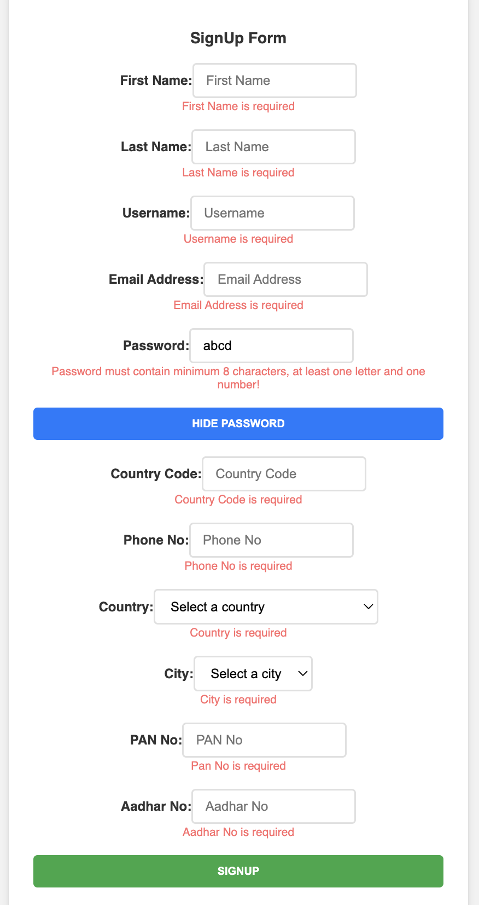
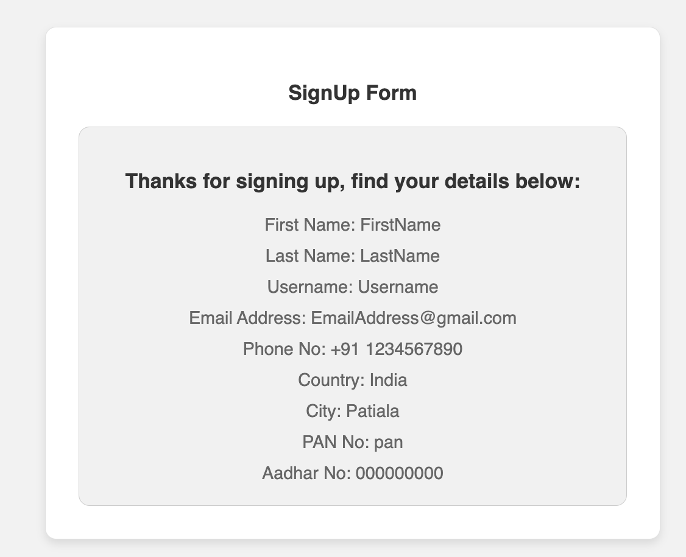

# React Signup Form

This React application provides a robust signup form with comprehensive validation of required fields without relying on third-party libraries. It showcases best practices for form handling in React, including dynamic error messaging, conditional button enablement, and reactive data display upon successful submission.

## Features

- **Form Validation**: Ensures all fields are correctly filled before submission can occur.
- **Dynamic Error Messaging**: Displays validation errors as users type, improving the user experience.
- **Conditional Button Enablement**: The submit button remains disabled until all form validations pass.
- **Dynamic Dropdowns**: Country and city fields dynamically update based on user selection.
- **Password Toggle**: Users can toggle visibility of the password field.
- **Multi-Page Experience**: After a successful submission, user details are displayed on a new page.

## Acknowledgements

This project utilizes JSON data for countries and cities provided by [all-countries-and-cities-json](https://github.com/russ666/all-countries-and-cities-json) (countries.json).

## Screenshots





## Getting Started

### Prerequisites

Before you begin, ensure you have the following installed:

- Node.js - [Download & Install Node.js](https://nodejs.org/en/download/) and the npm package manager.

### Installation

Clone the repository to your local machine:

```bash
git clone https://github.com/guddu69/signUp-Form.git
cd signUp-Form
```

Running the application:

```
npm install
npm start
```
